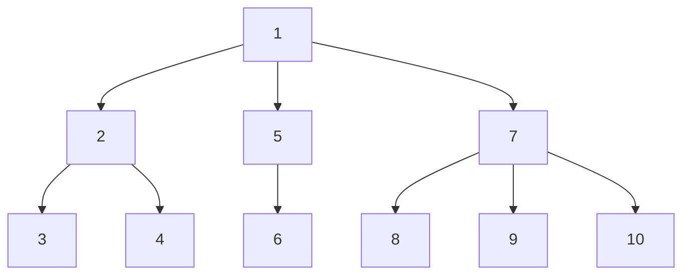
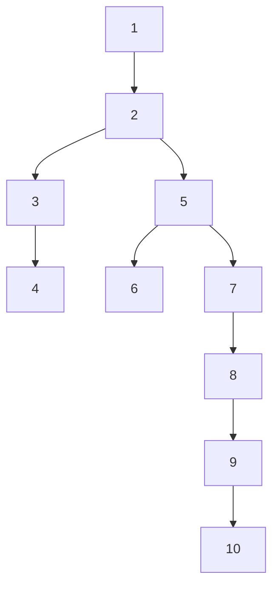
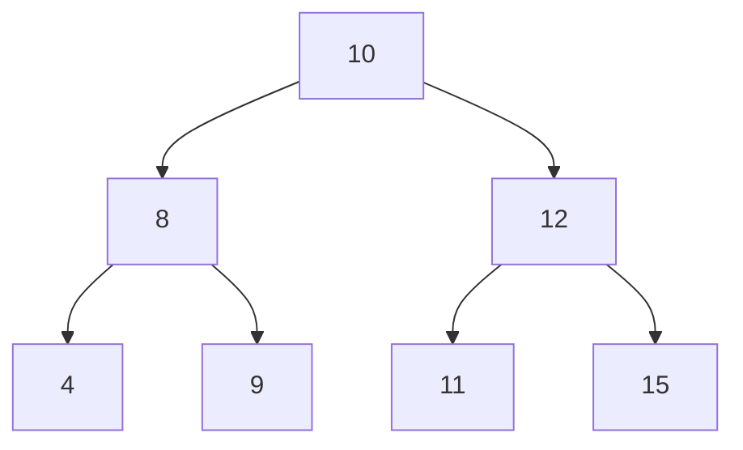

# What is a binary tree?

A binary tree is a tree in which nodes can have at most 2 children. There are some variants of the binary tree:

- Strict/Proper binary tree: each node can have either 2 or no children at all.
- Complete binary tree: all levels, except possibly the last level are completely filled and all nodes are as left as possible.
- Perfect binary tree: a binary tree that has all possible nodes in each level. For example, a tree with height 3 should be able to contain at most $2³ + 2² + 2¹ + 2⁰$ nodes. The general formula should be $2^{l+1} - 1$, $l$ being the height of the tree.
- Balanced binary tree: a balanced binary tree is a tree where the difference between the height of left and right children subtree is never more than 1 for every single node.

>[!info]
>There's some really valuable info about trees that help us calculate things like worst case scenarios for searches. One important thing to keep in mind is that, given that the **height** of a tree is the distance between the root of a tree and its farest leaf, some people wonder what's the height of an empty tree. **By definition, an empty tree has a height of -1**. This often helps understanding the meaning of a balanced binary tree.

# Converting common trees into binary trees

Every tree can be converted into a binary one following those steps:

- Make the assumption that the root of the tree will still be the root after the transformation.
- Connect each sibling node to each other.
- Cut the parent-children relationship of every node except for the leftmost one.
- Rearrange visually.






# How to implement binary trees

There are two main ways of implementing binary trees:
- Dynamically created nodes
- Arrays

Then one might ask, "how is it even possible to implement binary trees with arrays"? Consider that we have an infinite empty array. Let's fit the root value in the first position, index 0. Using a formula where the left child is stored always in the position $2i + 1$ and the right one in the position $2i + 2$, it is in fact possible to manage a binary tree with an array.

|0|1|2|3|4|5|6|
|----|----|----|----|----|----|----|
| Root | Root's left child (RLC) | Root's right child (RRC) | RLC's left child | RLC's right child | RRC's left child | RRC's right child|

And then there's the dynamical solution as well:

```cpp
class TreeNode{
	public:
	char Data;
	TreeNode *Lchild;
	TreeNode *Rchild;
};

class BinaryTree{
	private:
	TreeNode *Root;

	public:
	BinaryTree(){Root = NULL};
	TreeNode* GetNode(char);
	void InsertNode(TreeNode*);
	void DeleteNode(TreeNode*);
};
```

Each way of implementing has its own pros and cons.

Array-implemented trees are very simple of understanding and implementing and is efficient for complete binary trees, and they do not waste memory dealing with null pointers on the leaves. On the other hand, they can waste a lot of memory if the tree isn't near to being completed, lots of indexes won't be used on unbalanced trees, there's going to be lots of operations for insertions and removals, etc.

Dynamically-implemented trees can grow dynamically so it's not needed to foresee how big it needs to be, and there's no waste of memory for unbalanced trees. Insertions and removals are much more efficient and it deals well with dynamic-typed data. However, it isn't possible to access the nodes directly and it requires more memory to store each node due to the pointers.

The final veredict of this comparison is that array-implemented can be useful but only in very specific cases, so we're hardly ever dealing with them. Most of the time we're going to work with the dynamic implementation.

# Traversals

If we're dealing with trees we need to know how to manipulate data in it, after all the purpose of data structures is storing data in a way that we can insert and remove data from it somehow. But before diving deeper in the insertion and removal operations themselves, we need to know how to get to the point were we insert or remove nodes.
Those operations are mostly done at the $h$ level of the tree, so we need a way to reach there, and there are some types of traversals that can be performed to reach that.

Let's assume this following set of operations:

- D: read the data from a node
- L: move to the left-child node
- R: move to the right-child node

There are three most popular types of traversals:

- Preorder: D -> L -> R (DLR)
- Inorder: L -> D -> R (LDR)
- Postorder: L -> R -> D (LRD)

# EXTRA: Reconstruction of a tree

Did you know it is possible to reconstruct a tree given two of the traversals result? Well, it is possible if the two traversals are:

- Inorder and preorder
- Inorder and postorder

There's a ruleset that guides this reconstruction:

- If you've got the inorder and preorder traversals, the first element in the preorder is the root. If you've got the inorder and postorder, then the last element in the postorder is the root.


# Binary Search Tree (BST)

## Context

A BST is a binary tree specialized for quick searching operations.
Let's think about something here: which kind of DS would we use to store data that will be modified constantly? A lot of people would think about an array or a linked list at first. Let's take a look at the time cost of the operations on these DSs.

| |Array|Linked List|
|---|---|---|
|`Search(x)`|O(n)|O(n)|
|`Insert(x)`| O(1)|O(1)|
|`Remove(x)`|O(n)|O(n)|

Could be faster, don't you think? O(n) can mean a lot when dealing with lots of data.
Let's suppose that we're dealing with an ordered array. In ordered arrays, it is possible to perform binary search, which speds up time a lot. In the other hand, inserting elements get more complicated in order to keep the array sorted:

| |Sorted Array|
|---|---|
|`Search(x)`|O($\log{n}$)|
|`Insert(x)`| O(n)|
|`Remove(x)`|O(n)|

In Binary Search Trees, it is possible to keep every operation in $O(\log{n})$. The worst case scenario for BTs is $O(n)$, of course, but it can be evicted by keeping the tree balanced, making it a stable $O(\log{n})$.

But after all, what makes a BST different from other BTs?

## Definition

A BST is a tree in which, given a node $n$, every node in its left children subtree is lesser the the value it has, and the opposite goes for the right children subtree.


Note that this definition applies to every node in the tree. If we had a 13 where the 11 is in the graph above, it wouldn't be a BST anymore, cause 13 > 12 and 13 would be there as the left children of 12.

> BSTs don't need to be a perfect binary tree as in the example.


